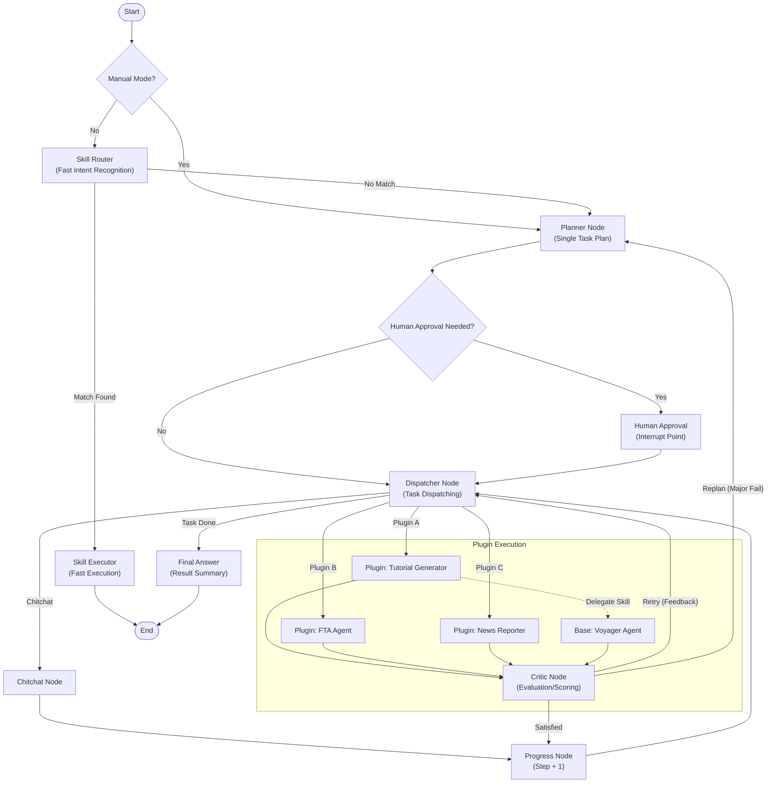

# SeerLord AI

[中文文档](README_zh.md) | **English**

> **SeerLord AI**: The next-generation modular AI agent orchestration platform based on micro-kernel architecture and LangGraph. It natively supports the MCP protocol and Human-in-the-loop collaboration, making complex agent development more stable and flexible.

## SeerLord AI: Redefining AI Agent Development Architecture

When building complex AI applications, we often face pain points such as severe code coupling, difficulty in extension, and chaotic state management. SeerLord AI was born to solve these problems.

As an **enterprise-grade AI Agent orchestration platform**, SeerLord AI adopts an advanced **"Micro-Kernel + Plugin"** architecture design. This means its core (Kernel) is only responsible for the most basic routing, memory management, and protocol adaptation, while all business capabilities (such as tutorial generation, real-time news, data analysis) are implemented through independent plugins. This design achieves true business isolation and plug-and-play capability.

## Why Choose SeerLord AI?

1. **Powerful Orchestration Capabilities**: Built on **LangGraph**, it natively supports complex graph-structured workflows (Graph Workflow), easily implementing advanced logic such as loops, branches, and fallbacks, rather than simple linear chains.
2. **Production-Grade Stability**: Fully asynchronous (Asyncio) backend design, with built-in database connection pool management and global exception circuit breaking mechanisms, ensuring robust operation in high-concurrency scenarios.
3. **Standardized Tool Ecosystem**: Fully integrates the **Model Context Protocol (MCP)**, making the connection between Agents and the external world (file systems, GitHub, databases) standardized and universal.
4. **Controllable Design**: Deeply integrates **Human-in-the-loop** mode. Agents can automatically pause during critical planning execution, waiting for human approval or correction, making every step of AI safe and controllable.
5. **Autonomous Evolutionary Skill Kernel (Voyager Agent)**: This is the **Core Highlight** of SeerLord AI. Unlike traditional agents with only preset generic capabilities, SeerLord integrates **Voyager Agent** as the foundational skill engine. It possesses the ability to **write code, self-correct, and accumulate/reuse skills**, enabling it to continuously learn new skills as tasks are executed, truly achieving "stronger with use."

## 🌟 Key Features

- **Dual-Mode Routing**: Supports both "Auto" intent recognition mode and "Manual" agent selection mode. Users can rely on AI for automatic planning or explicitly specify an Agent (e.g., Tutorial Agent) for deterministic execution.
- **Hierarchical Agent System**:
  - **Base Agent (Voyager Agent - The Core)**: The soul of the project. As a universal skill kernel, it empowers the system with autonomous learning and evolutionary capabilities. All other agents are built upon it, invoking its dynamically generated skills to solve specific problems.
  - **Business Agents**: e.g., `Tutorial Agent`, focused on domain-specific workflows. They do not reinvent the wheel but delegate to Voyager Agent for underlying capabilities, allowing them to focus on high-level logic.
- **Micro-Kernel Architecture**: A lightweight and stable core system responsible for lifecycle management, context sharing, and resource scheduling.
- **Skills Fast Track**: Provides a millisecond-level response execution path for simple commands (e.g., calculation, query), bypassing complex planning workflows.
- **Plugin System**: All business capabilities (such as news reporting, tutorial generation, financial analysis, etc.) are implemented via plugins, enabling plug-and-play functionality.
- **Agent Orchestration (LangGraph)**: Utilizes LangGraph to build complex stateful multi-agent workflows.
- **MCP Support**: Integrates the Model Context Protocol (MCP) for standardized context and tool interactions.
- **High-Performance Backend**: An asynchronous backend built with FastAPI, supporting SSE streaming responses.

## 🏗️ Architecture Flow



## 🛠️ Tech Stack

- **Language**: Python 3.11+
- **Frameworks**: FastAPI, LangChain, LangGraph
- **Database**: PostgreSQL (AsyncPG)
- **Utilities**: Pydantic, Loguru, SSE-Starlette

## 📂 Directory Structure

```
seerlord_ai/
├── server/
│   ├── core/           # Core configuration & LLM wrappers
│   ├── kernel/         # Micro-kernel implementation (Registry, MCP Manager, Memory Manager)
│   ├── plugins/        # Plugins directory (contains various Agent implementations)
│   ├── skills/         # Skills directory (Fast Track atomic capabilities)
│   └── main.py         # Application entry point
├── mcp_services/       # MCP service implementations
├── scripts/            # Utility scripts
└── pyproject.toml      # Project dependencies configuration
```

## 🚀 Quick Start

### Prerequisites

- Python 3.11 or higher
- PostgreSQL Database

### Installation

It is recommended to use Poetry or pip for installation.

```bash
# Install dependencies using pip
pip install -r requirements.txt
```

### Configuration

Copy the example environment variable file and modify the configuration:

```bash
cp .env.example .env
# Edit the .env file to configure your OpenAI API Key and database connection details
```

### Start the Service

```bash
# Start the backend service
python server/main.py
```

## 📄 License

This project is open-sourced under the [MIT License](LICENSE).

You are free to:
- ✅ Use it commercially
- ✅ Modify the code
- ✅ Distribute copies
- ✅ Use it privately

Just include the original license and copyright notice in any copy of the software/source.
