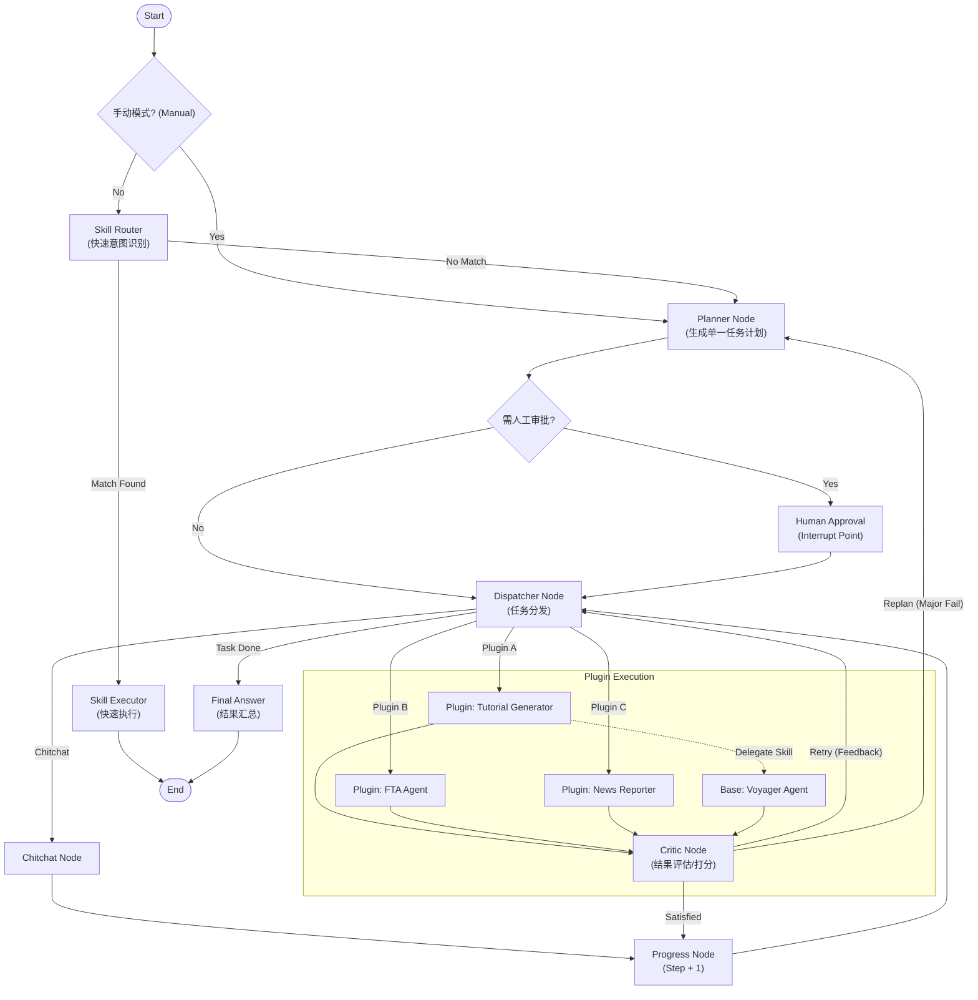

# SeerLord AI

**中文文档** | [English](README.md)

> **SeerLord AI**：一个基于**微内核 + 插件化架构**构建的模块化 AI 平台。它利用 LangGraph 进行强大的智能体（Agent）编排，支持灵活的插件扩展，旨在为开发者提供一个高效、可扩展的 AI 应用开发框架。

## SeerLord AI：重新定义 AI Agent 开发架构

在构建复杂的 AI 应用时，我们往往面临代码耦合严重、扩展困难、状态管理混乱等痛点。 SeerLord AI 正是为了解决这些问题而生。

作为一个 企业级 AI Agent 编排平台 ，SeerLord AI 采用了先进的 "Micro-Kernel + Plugin"（微内核+插件） 架构设计。这意味着它的核心（Kernel）仅负责最基础的路由、记忆管理和协议适配，而所有的业务能力（如教程生成、实时新闻、数据分析）都通过独立的插件（Plugin）实现。这种设计实现了真正的业务隔离与即插即用。

## 为什么选择 SeerLord AI？

1. 强大的编排能力 ：基于 LangGraph 构建，原生支持复杂的图结构工作流（Graph Workflow），轻松实现循环、分支、回退等高级逻辑，而非简单的线性链（Chain）。
2. 生产级稳定性 ：全异步（Asyncio）后端设计，内置数据库连接池管理、全局异常熔断机制，确保在高并发场景下的稳健运行。
3. 标准化的工具生态 ：全面集成 Model Context Protocol (MCP) ，让 Agent 连接外部世界（文件系统、GitHub、数据库）变得标准化、通用化。
4. **可控性设计**：深度集成了 **Human-in-the-loop（人机协同）** 模式。Agent 在执行关键规划时可自动暂停，等待人工审批或修正，让 AI 的每一步都安全可控。
5. **自主进化的技能内核 (Voyager Agent)**：这是 SeerLord AI 的**核心亮点**。不同于传统 Agent 仅具备预设的通用能力，SeerLord 内置了 **Voyager Agent** 作为基础技能引擎。它具备**代码编写、自我纠错、技能沉淀与复用**的能力，能够随着任务的执行不断积累新技能，实现真正的“越用越强”。

## 🌟 项目亮点

- **双模式路由 (Dual-Mode Routing)**: 支持 "Auto" 自动意图识别模式与 "Manual" 手动指定智能体模式。用户既可以依赖 AI 自动规划，也可以强制指定特定 Agent（如 Tutorial Agent）执行任务，确保结果的确定性。
- **分层智能体体系 (Hierarchical Agent System)**: 
  - **基础智能体 (Voyager Agent - The Core)**: 项目的灵魂所在。作为通用的技能内核，它赋予了系统自主学习和进化的能力。其他 Agent 均构建于其上，调用其动态生成的技能来解决具体问题。
  - **业务智能体 (Business Agents)**: 如 `Tutorial Agent`，专注于特定领域的业务流程。它们不重复造轮子，而是通过委托 Voyager Agent 获取底层能力，从而专注于高层逻辑。
- **微内核架构 (Micro-Kernel)**: 核心系统轻量稳定，负责生命周期管理、上下文共享和资源调度。
- **Skills 快速通道 (Fast Track)**: 针对简单指令（如计算、查询）提供毫秒级响应的技能执行路径。这些是系统内置的**静态原子技能**（如 Calculator, CurrentTime），无需复杂的规划流程。
- **插件化系统 (Plugin System)**: 所有的业务能力（如新闻播报、教程生成、金融分析等）均通过插件实现，即插即用。
- **智能体编排 (LangGraph)**: 利用 LangGraph 构建复杂的有状态多智能体工作流。
- **MCP 支持**: 集成 Model Context Protocol (MCP)，实现标准化的上下文和工具交互。
- **双引擎知识系统**: 结合了标准 **RAG**（基于 Qdrant 的向量检索）用于高效文档检索，以及先进的 **GraphRAG**（基于 Neo4j 的图谱检索）用于深度实体关系推理与混合搜索。
- **高性能后端**: 基于 FastAPI 构建的异步后端，支持 SSE 流式响应。

## 🔌 内置生态系统

### 插件 (Agents)
SeerLord 在 `server/plugins/` 目录下提供了丰富的内置插件：
- **Comic Book Generator**: 自动根据故事生成漫画。
- **Data Analyst**: 数据分析与报告生成专家。
- **Deep Research**: 针对复杂话题进行深度研究。
- **Document Translator**: 保持格式的文档翻译工具。
- **FTA Agent**: 故障树分析 (Fault Tree Analysis) 智能体，用于系统可靠性工程。
- **General Chat**: 通用对话智能体。
- **Novel Generator**: 小说与创意故事写作助手。
- **Podcaster**: 播客脚本与音频内容生成。
- **PPT Generator**: 自动生成演示文稿 (PPT)。
- **Reasoning Engine**: 处理复杂问题的推理引擎。

### MCP 服务
在 `mcp_services/` 目录下集成了以下 MCP 服务以扩展能力：
- **Markdownify**: 将网页内容转换为干净的 Markdown。
- **MDToFiles**: 将 Markdown 文件拆分为多个文件。
- **News**: 获取并处理实时新闻更新。

## 🏗️ 架构概览 (Architecture)



## 🛠️ 技术栈

- **语言**: Python 3.11+
- **框架**: FastAPI, LangChain, LangGraph
- **数据库**: PostgreSQL（可选；用于持久化/Checkpoint）
- **向量库**: Qdrant（可选；用于记忆、技能检索与 RAG）
- **图数据库**: Neo4j（可选；用于知识图谱与 GraphRAG）
- **工具库**: Pydantic, Loguru, SSE-Starlette
- **管理台**: Vue 3 + Vite + TypeScript（位于 `admin/`）

## 📂 目录结构

```
seerlord_ai/
├── admin/              # Vue3 管理台（可选）
├── server/
│   ├── core/           # 核心配置与 LLM 封装
│   ├── kernel/         # 微内核实现 (注册表, MCP 管理, 记忆管理)
│   ├── main.py         # 应用入口
├── mcp_services/       # MCP 服务实现
├── scripts/            # 实用脚本
├── mcp.json            # MCP 服务配置（启动时如存在会自动加载）
└── pyproject.toml      # 项目依赖配置
```

## 🚀 快速开始

### 前置要求

- Python 3.11 或更高版本
- Node.js 18+（可选；用于 `admin/` 与部分 MCP 服务）
- PostgreSQL（可选；用于 Checkpoint 与技能元数据）
- Qdrant（可选；用于向量记忆与技能检索）
- Neo4j（可选；用于知识图谱与 GraphRAG）

### 安装依赖

建议使用 Poetry 或 pip 进行安装。

```bash
# 使用 pip 安装依赖
pip install -r requirements.txt
```

### 配置环境

复制环境变量示例文件并修改配置：

```bash
cp .env.example .env
# 编辑 .env 文件，配置 LLM Provider 与（可选）数据库/Qdrant
```

关键说明：
- `LLM_PROVIDER` 支持 `openai` 与 `ollama`（兼容 OpenAI `/v1` 协议的服务也可用）。
- 未配置数据库时，LangGraph 会回退到内存 Checkpoint（重启后状态丢失）。
- 未配置 Qdrant 时，向量记忆与基于向量的技能检索会被禁用。
- 大部分 `/api/*` 与 `/agent` 路由需要携带用。
- 未配置 Neo4j 时，知识图谱与 GraphRAG 相关功能将不可租户头 `X-API-Key`；本地开发可用 `sk-admin-test`（见 `server/api/auth.py`）。

### 启动服务

```bash
# 启动后端服务
python run.py
```

或：
```bash
python -m server.main
```

### 健康检查

- `GET http://localhost:8000/health`
- API 文档：`http://localhost:8000/docs`

### 首启初始化管理员（可选）

用于创建第一个管理员账号（仅当用户表为空时允许执行一次）：

1. 在 `.env` 中设置 `SETUP_TOKEN`
2. 调用：
   - `POST http://localhost:8000/api/v1/setup/initialize`
   - Header：`X-Setup-Token: <SETUP_TOKEN>`
   - Body：`{"username":"admin","password":"change_me_please"}`

### 启动管理台（可选）

```bash
cd admin
npm install
npm run dev
```

可通过 `VITE_API_URL`（以及可选的 `VITE_TENANT_API_KEY`）指向后端地址。

## � 引用

如果您在研究中觉得本项目有用，请引用我们的论文：

> **SeerLord AI Skill System**
> DOI: [10.5281/zenodo.18144848](https://doi.org/10.5281/zenodo.18144848)

## �📄 开源协议

本项目采用 [MIT 许可证](LICENSE) 开源。

这意味着您可以自由地：
- ✅ 商业使用
- ✅ 修改代码
- ✅ 分发副本
- ✅ 私有使用

只需在副本中包含原始许可证和版权声明即可。
