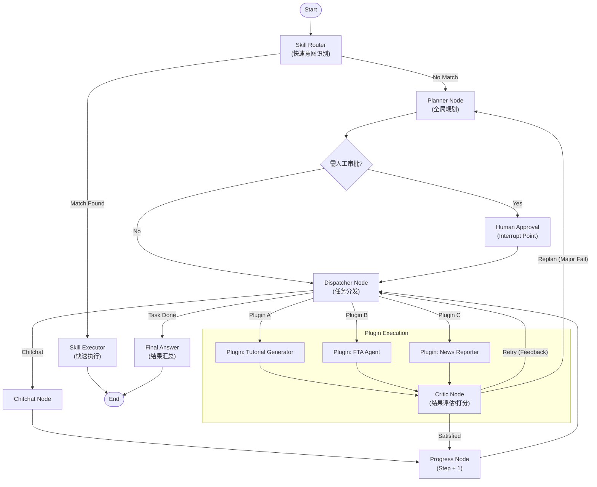

# SeerLord AI

**中文文档** | [English](README.md)

> **SeerLord AI**：一个基于**微内核 + 插件化架构**构建的模块化 AI 平台。它利用 LangGraph 进行强大的智能体（Agent）编排，支持灵活的插件扩展，旨在为开发者提供一个高效、可扩展的 AI 应用开发框架。

## SeerLord AI：重新定义 AI Agent 开发架构

在构建复杂的 AI 应用时，我们往往面临代码耦合严重、扩展困难、状态管理混乱等痛点。 SeerLord AI 正是为了解决这些问题而生。

作为一个 企业级 AI Agent 编排平台 ，SeerLord AI 采用了先进的 "Micro-Kernel + Plugin"（微内核+插件） 架构设计。这意味着它的核心（Kernel）仅负责最基础的路由、记忆管理和协议适配，而所有的业务能力（如教程生成、实时新闻、数据分析）都通过独立的插件（Plugin）实现。这种设计实现了真正的业务隔离与即插即用。

## 为什么选择 SeerLord AI？

1. 强大的编排能力 ：基于 LangGraph 构建，原生支持复杂的图结构工作流（Graph Workflow），轻松实现循环、分支、回退等高级逻辑，而非简单的线性链（Chain）。
2. 生产级稳定性 ：全异步（Asyncio）后端设计，内置数据库连接池管理、全局异常熔断机制，确保在高并发场景下的稳健运行。
3. 标准化的工具生态 ：全面集成 Model Context Protocol (MCP) ，让 Agent 连接外部世界（文件系统、GitHub、数据库）变得标准化、通用化。
4. 可控性设计 ：深度集成了 Human-in-the-loop（人机协同） 模式。Agent 在执行关键规划时可自动暂停，等待人工审批或修正，让 AI 的每一步都安全可控。

## 🌟 项目亮点

- **微内核架构 (Micro-Kernel)**: 核心系统轻量稳定，负责生命周期管理、上下文共享和资源调度。
- **Skills 快速通道 (Fast Track)**: 针对简单指令（如计算、查询）提供毫秒级响应的技能执行路径，无需复杂的规划流程。
- **插件化系统 (Plugin System)**: 所有的业务能力（如新闻播报、教程生成、金融分析等）均通过插件实现，即插即用。
- **智能体编排 (LangGraph)**: 利用 LangGraph 构建复杂的有状态多智能体工作流。
- **MCP 支持**: 集成 Model Context Protocol (MCP)，实现标准化的上下文和工具交互。
- **高性能后端**: 基于 FastAPI 构建的异步后端，支持 SSE 流式响应。

## 🏗️ 架构概览 (Architecture)



## 🛠️ 技术栈

- **语言**: Python 3.11+
- **框架**: FastAPI, LangChain, LangGraph
- **数据库**: PostgreSQL (AsyncPG)
- **工具库**: Pydantic, Loguru, SSE-Starlette

## 📂 目录结构

```
seerlord_ai/
├── server/
│   ├── core/           # 核心配置与 LLM 封装
│   ├── kernel/         # 微内核实现 (注册表, MCP 管理, 记忆管理)
│   ├── plugins/        # 插件目录 (包含各类 Agent 实现)
│   ├── skills/         # 技能目录 (Fast Track 原子能力)
│   └── main.py         # 应用入口
├── mcp_services/       # MCP 服务实现
├── scripts/            # 实用脚本
└── pyproject.toml      # 项目依赖配置
```

## 🚀 快速开始

### 前置要求

- Python 3.11 或更高版本
- PostgreSQL 数据库

### 安装依赖

建议使用 Poetry 或 pip 进行安装。

```bash
# 使用 pip 安装依赖
pip install -r requirements.txt
```

### 配置环境

复制环境变量示例文件并修改配置：

```bash
cp .env.example .env
# 编辑 .env 文件，配置 OpenAI API Key 和数据库连接信息
```

### 启动服务

```bash
# 启动后端服务
python server/main.py
```

## 📄 开源协议

本项目采用 [MIT 许可证](LICENSE) 开源。

这意味着您可以自由地：
- ✅ 商业使用
- ✅ 修改代码
- ✅ 分发副本
- ✅ 私有使用

只需在副本中包含原始许可证和版权声明即可。
