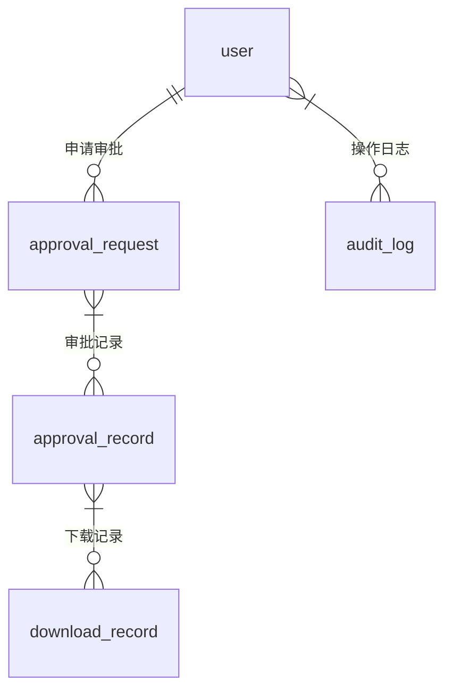
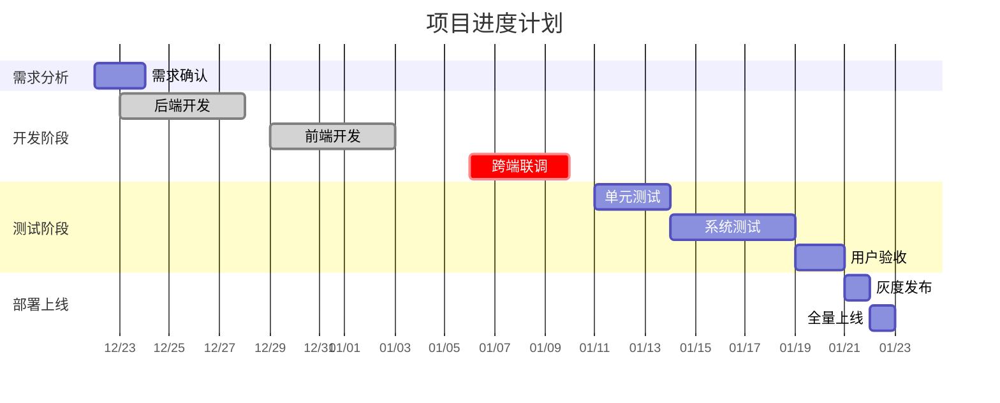

# 系统开发综合指导手册

## 第一部分：产品需求文档 (PRD & UI)

### 1. 全局交互规范
- **异常处理机制**  
  - 断网场景：展示"网络异常，请稍后重试"提示框（底部居中，持续5秒后自动消失）  
  - 报错提示：采用统一错误码体系（如：4001-权限不足/4002-流程异常），配合对应图标+简要说明  
  - 弹窗规范：采用半透明遮罩层，动画时长0.3s，支持ESC键关闭

### 2. 详细功能逻辑
#### 流程图 (Flowchart)
```mermaid
graph TD
    A[用户查看附件] --> B{是否触发审批流程?}
    B -->|点击"申请下载审批"按钮| C[弹出确认框]
    C --> D{用户确认操作?}
    D -->|确认| E[推送审批请求]
    E --> F[创建审批任务]
    F --> G{审批状态?}
    G -->|通过| H[显示下载按钮]
    G -->|拒绝| I[通知申请人]
```

#### 字段定义
| 字段名称        | 长度限制 | 类型       | 必填项 | 校验规则          |
|-----------------|----------|------------|--------|-------------------|
| 用户ID          | 128      | UUID       | 是     | 必须唯一          |
| 文件名          | 255      | String     | 是     | 中文/英文/数字    |
| 申请时间        | -        | Timestamp  | 是     | 自动记录          |
| 用户IP          | 45       | String     | 是     | IPv4格式校验      |
| 审批状态        | -        | Enum       | 是     | 枚举值：待审批/通过/拒绝 |

#### UI原型/高保真图
> 需参考Figma/蓝湖链接：[https://figma.com/xxx](https://figma.com/xxx)  
> **交互说明**：  
> 1. 下载按钮默认隐藏，仅在审批通过后通过CSS动态显示  
> 2. 审批状态变化时需触发页面局部刷新（使用Intersection Observer优化性能）

## 第二部分：详细架构与技术方案 (Technical Specification)

### 1. 技术栈详细清单
- **版本锁定**  
  - Spring Boot 3.2.5  
  - React 18.2.0  
  - Python 3.10.12  
- **依赖库**  
  - Redis 7.0.10（缓存审批状态）  
  - RabbitMQ 3.12.0（异步审批通知）  
  - Elasticsearch 8.11.3（审计日志检索）  
  - JWT 0.1.1（OAuth2鉴权）  

### 2. 数据库设计 (Database Design)
#### ER图 (Entity-Relationship Diagram)


#### 数据字典
**用户表 (user)**  
| 字段名        | 类型         | 索引 | 说明         |
|---------------|--------------|------|--------------|
| user_id       | UUID         | PK   | 主键         |
| username      | VARCHAR(50)  |      | 登录用户名   |
| ip_address    | VARCHAR(45)  |      | 最近登录IP  |
| create_time   | TIMESTAMP    |      | 创建时间     |

**审批请求表 (approval_request)**  
| 字段名        | 类型         | 索引 | 说明         |
|---------------|--------------|------|--------------|
| id            | BIGINT       | PK   | 主键         |
| user_id       | UUID         |      | 关联用户     |
| file_name     | VARCHAR(255)|      | 文件名称     |
| status        | ENUM         |      | 审批状态     |
| request_time  | TIMESTAMP    |      | 申请时间     |

### 3. API 接口规范
#### 统一响应结构
```json
{
  "code": 200,
  "message": "操作成功",
  "data": {
    "approval_id": "123456",
    "file_url": "https://xxx.com/download"
  },
  "timestamp": "2025-12-22T12:00:00Z"
}
```

#### 鉴权机制
- 使用JWT + OAuth2.0混合模式  
- Access Token有效期：2小时  
- Refresh Token有效期：7天  
- 需在请求头中携带：`Authorization: Bearer {token}`

### 4. 工程结构与规范
#### 代码目录结构
```
src/
├── main/
│   ├── java/                # 后端代码
│   │   └── com.example.app/
│   │       ├── controller/   # 接口层
│   │       ├── service/      # 业务逻辑
│   │       └── repository/   # 数据访问
│   └── resources/           # 配置文件
│       └── application.yml
├── frontend/                # 前端代码
│   ├── src/
│   │   ├── assets/          # 静态资源
│   │   ├── components/      # 公共组件
│   │   └── views/           # 页面视图
│   └── package.json
└── pom.xml
```

#### Git 分支管理策略
```bash
develop
│
├── feature/feature-approval-20251222  # 功能开发分支
│
└── release/release-2.0.0             # 发布分支
```

## 第三部分：WBS与进度执行 (Execution Plan)

### 1. WBS 工时估算表
| 模块             | 子任务                   | 前置任务           | 后端负责人 | 前端负责人 | 预估工时(h) | 开始时间 | 截止时间 | 风险备注           |
|------------------|--------------------------|--------------------|------------|------------|-------------|----------|----------|--------------------|
| 审批流程         | 1.1 审批状态机设计       | -                  | 张伟       | 李芳       | 8           | 2025-12-23 | 2025-12-25 | 状态机需支持回滚   |
|                  | 1.2 审批通知模块         | 1.1               | 王强       | 李芳       | 6           | 2025-12-26 | 2025-12-28 | 需集成RabbitMQ     |
| 按钮状态管理     | 2.1 按钮状态控制逻辑     | -                  | 赵磊       | 周婷       | 4           | 2025-12-29 | 2025-12-31 | 需处理并发请求     |
|                  | 2.2 前端状态渲染         | 2.1               | -          | 周婷       | 3           | 2026-01-01 | 2026-01-02 | 需兼容不同浏览器   |
| 日志记录         | 3.1 操作日志存储         | -                  | 张伟       | -          | 5           | 2026-01-03 | 2026-01-05 | 需支持审计查询     |
| 接口联调         | 4.1 接口文档整理         | 1.2,2.1,3.1       | 王强       | 李芳       | 4           | 2026-01-06 | 2026-01-07 | 需覆盖所有API      |
|                  | 4.2 跨端联调             | 4.1               | 王强       | 李芳       | 8           | 2026-01-08 | 2026-01-10 | 需处理网络异常     |

### 2. 项目进度计划 (Gantt Chart)


> **关键节点**  
> - **联调时间点**：2026-01-06 17:00  
> - **提测时间点**：2026-01-11 09:00  
> - **上线时间点**：2026-01-22 10:00