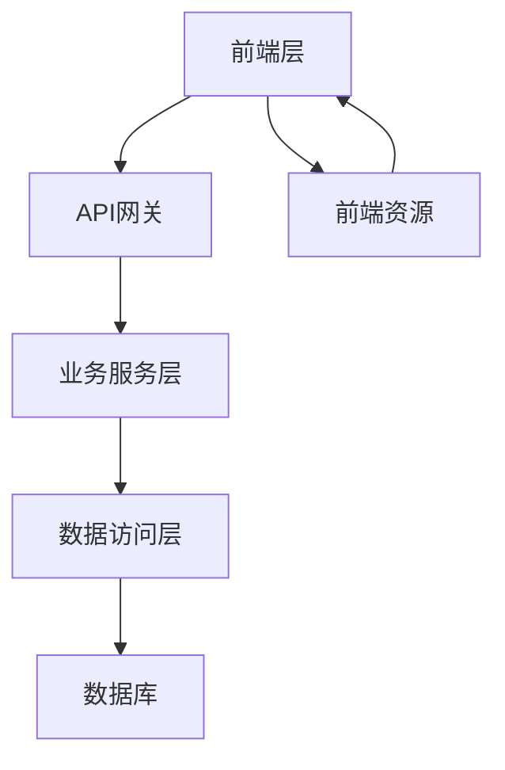

# 项目需求规格说明书与实施方案

## 1. 项目概述 (Project Overview)
- **项目背景**：当前系统存在文件下载权限管理不严格的问题，普通用户可直接浏览文件但无法下载，无法满足企业对敏感文件访问的审计合规要求。通过引入审批流程，确保所有下载行为可追溯，符合数据安全与合规管理规范。
- **建设目标**：实现"无下载按钮→审批→显示下载按钮"的权限控制逻辑，确保文件下载操作可审计，审批流程可追踪，同时保持用户操作的流畅性与系统稳定性。

## 2. 需求范围 (Scope of Work)
### 功能列表 (Feature List)
| 一级模块 | 二级模块 | 功能描述 |
|---------|---------|---------|
| 按钮状态管理 | 初始状态 | 用户查看附件时仅显示"申请下载审批"按钮 |
| 按钮状态管理 | 触发后状态 | 点击按钮后弹出确认框，推送审批请求并记录日志 |
| 按钮状态管理 | 审批中状态 | 创建审批任务，通过站内信通知审批人 |
| 按钮状态管理 | 审批通过状态 | 动态显示下载按钮，并更新申请页面状态 |
| 按钮状态管理 | 审批拒绝状态 | 通知申请人审批未通过并记录拒绝原因 |
| 审批流程管理 | 审批请求记录 | 存储审批请求信息（含用户IP、时间戳等） |
| 审批流程管理 | 审批人通知机制 | 支持站内信、邮件等多渠道通知 |
| 审批流程管理 | 审批结果同步 | 实时更新申请状态并触发界面变更 |

### 非功能需求
- **性能要求**：审批流程响应时间≤2秒，支持1000并发审批请求
- **安全性**：采用HTTPS加密传输，敏感操作记录审计日志
- **兼容性**：兼容主流浏览器（Chrome 100+、Firefox 100+、Edge 100+）

### 不包含范围 (Out of Scope)
- 文件下载功能本身的实现
- 其他审批流程的集成（如OA系统审批）
- 第三方服务调用（如企业微信通知接口）
- 多语言国际化支持

## 3. 总体架构设计 (High-Level Architecture)
### 逻辑架构图


### 技术选型说明
- **前端**：采用Vue.js框架实现状态驱动的UI交互，确保按钮状态变更实时响应
- **后端**：基于Spring Boot构建微服务架构，支持高并发审批请求处理
- **数据库**：使用MySQL集群存储审批记录与操作日志，保障数据可靠性
- **消息队列**：通过RabbitMQ实现审批通知的异步处理

### 部署架构图
```
[负载均衡] --> [Web服务器集群]
[Web服务器集群] --> [应用服务器]
[应用服务器] --> [数据库集群]
[应用服务器] --> [消息队列]
[数据库集群] --> [备份存储]
```
- 采用AWS EC2集群部署，通过ELB实现负载均衡
- 数据库采用主从架构，每日增量备份至S3存储
- 消息队列配置自动重试机制，保障通知可靠性

## 4. 项目计划与里程碑 (Project Plan)
### 主要里程碑 (Milestones)
| 阶段 | 关键交付物 | 交付标准 |
|------|------------|----------|
| 立项 | 需求确认书 | 客户签字确认 |
| UI确认 | 界面原型 | 客户确认设计稿 |
| 开发完成 | 可运行系统 | 通过单元测试 |
| 测试验收 | 测试报告 | 通过UAT测试 |
| 上线 | 上线部署方案 | 完成灰度发布 |

### 交付时间表
- **T+0周**：完成需求确认与UI设计
- **T+2周**：完成核心功能开发与单元测试
- **T+3周**：完成集成测试与压力测试
- **T+4周**：完成UAT测试与上线准备
- **T+5周**：系统正式上线并完成验收

## 5. 工作量与报价 (Effort & Budget)
### 工时汇总
| 模块 | 人天 |
|------|------|
| 按钮状态管理 | 8人天 |
| 审批流程管理 | 12人天 |
| 日志记录与审计 | 6人天 |
| 系统集成与测试 | 10人天 |
| **总计** | **36人天** |

### 资源需求
- **客户配合**：提供审批人权限配置模板、服务器账号权限、UI确认时间窗口
- **第三方支持**：需确认企业微信通知接口权限（如需）
- **测试环境**：需提供测试数据库账号与访问权限

> 注：本方案基于敏捷开发模式，实际交付时间将根据客户反馈进行迭代调整，最终验收标准以双方签署的《项目验收标准书》为准。